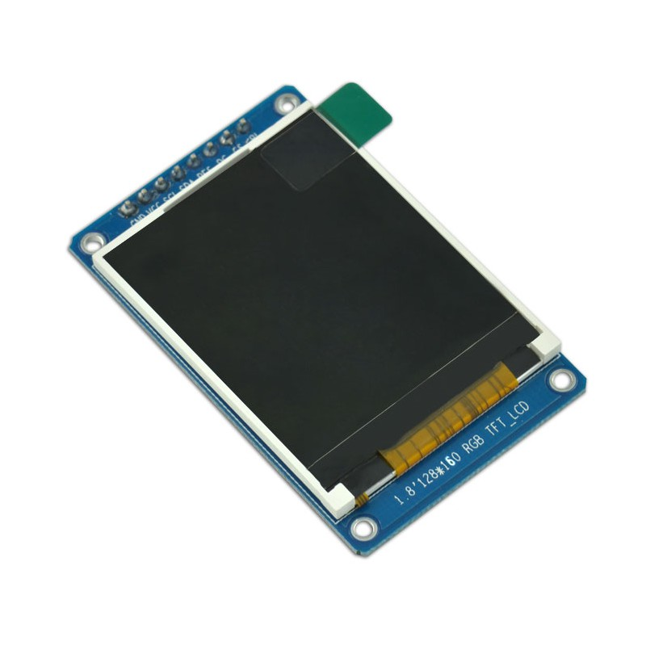
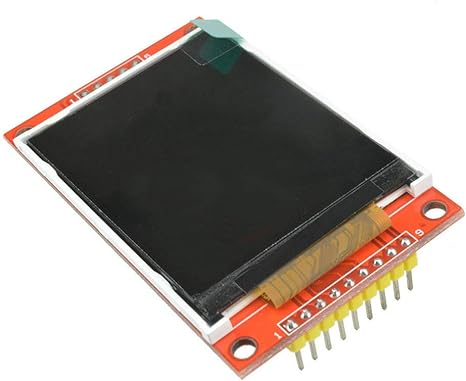
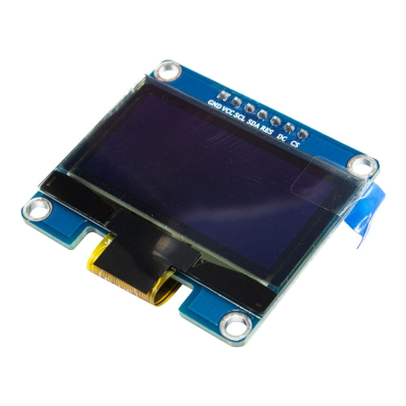
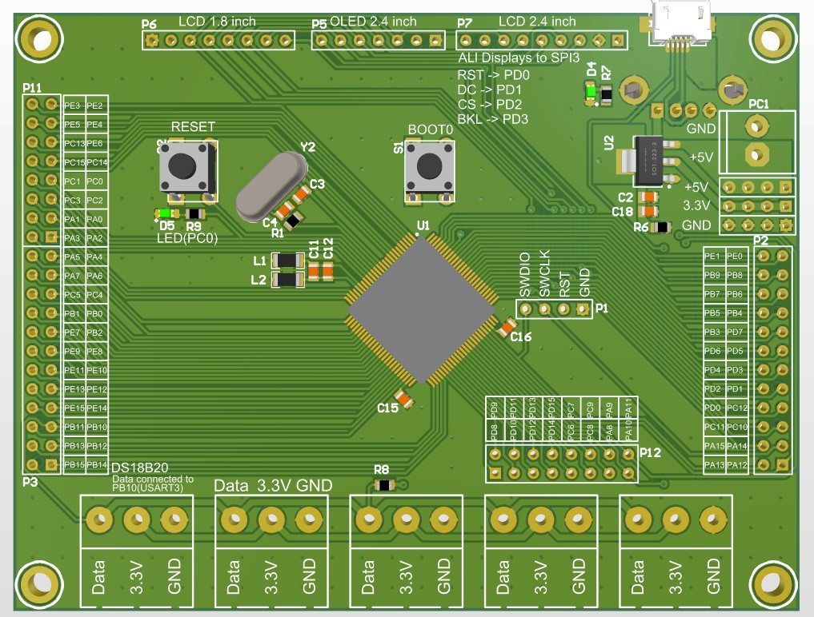

# EmWin Graphic Library Setup
A PCB designed for SPI Display development projects using STM32 microcontrollers. An STM32F407 is the main chip of the PCB. 
Three kinds of displays are usable with this PCB. The first one is a 1.8-inch TFT LCD with a resolution of 128 by 160 pixels with ST7735 driver chip.



The second LCD is a 2.4-inch QVGA(240 by 320 pixels) LCD with ILI9341 driver chip with a maximum color depth of 18bits(262K). This LCD module also embedded an SD card slot too.



The last display that could be used on this PCB is an SPI OLED display, in his case up to 2.4 inches. Most OLED displays use SSD1306 or SSD1309 chip drivers which are similar.



All of these displays share the same SPI interface connected to the MCU, but all of the MCU pins are connected to two pin header connectors on the sides of the board, in case you need them in other projects. Five terminals are placed at the bottom of the board for connecting DS18B20 temperature sensors. These sensors communicate over the OneWire bus and only need one pin to connect to the MCU.


## Software Projects
For each display a project has been made that, the display is initialized in it with software library that has been written for that specific display, and the data of DS18B20 sensors are shown on the display. The DS18B20 is connected to USART3 and the OneWire library uses USART receive interrupt to get the temperature data. If you use another USART, you should change the code in the `OneWire.h` file and declare an external `UART_HandleTypeDef` variable there. You should change this file according to your project configuration.
```C
extern UART_HandleTypeDef huart3;
#define ow_uart huart3
#define OW_USART USART3
#define MAXDEVICES_ON_THE_BUS 5
```
The display driver libraries are placed in the `ST7735` and `OLED_ssd1309` folders of the projects, and with these libraries, you can initialize the chip and do some basic graphic stuff. 

For more complex graphics and better GUI, I used the EmWin graphic library. I have made the changes in the configuration files so that this graphic library can be used to display the desired GUI on the display, even on OLEDs. You can find the configuration files in the `STemWin/Config` folder of the project. With these configurations of the Emwin library, you can benefit from all of the EmWin features like widgets, windows and memory devices for small projects using these displays.